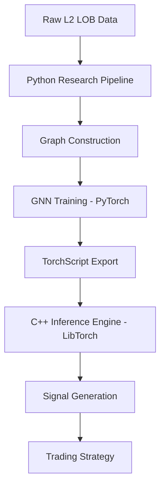

# Graph Neural Network on Market Microstructure

A production-ready system for predicting short-term mid-price movement (1–50 ms horizon) using Level-2 Limit Order Book (LOB) data, Graph Neural Networks (GNN), and a high-performance C++ inference engine.

## 🚀 Overview

This project implements a hybrid research-to-production pipeline:
1.  **Python Pipeline**: Data parsing, graph construction, GNN model training (PyTorch Geometric), and TorchScript export.
2.  **C++ Inference Engine**: Ultra-low latency inference using LibTorch, designed for high-frequency trading (HFT) use cases.

## 🏗️ System Architecture



## 📊 Graph Construction Design

Each LOB snapshot is converted into a graph structure where:
-   **Nodes**: Each price level (10 bid, 10 ask) is a node (20 nodes total).
-   **Node Features**: Relative price distance from mid, normalized volume, side indicator, and order imbalance.
-   **Edges**:
    -   **Intra-side**: Connects adjacent price levels on the same side.
    -   **Cross-side**: Connects corresponding bid and ask levels (e.g., Bid 1 ↔ Ask 1).

## 🧠 Model Architecture

The core model is a **Graph Convolutional Network (GCN)**:
-   2x GCN Layers (64 and 32 hidden units).
-   Global Mean Pooling to aggregate node features.
-   Fully Connected layer for classification (Up, Down, Neutral).

## 🛠️ Installation & Usage

### Prerequisites
-   Python 3.8+
-   PyTorch & PyTorch Geometric
-   LibTorch (C++ version)
-   CMake 3.10+

### Python Pipeline (Research)
1.  **Install dependencies**:
    ```bash
    pip install torch torch-geometric pandas numpy scikit-learn tqdm
    ```
2.  **Generate synthetic data** (if real L2 data is unavailable):
    ```bash
    python python/generate_data.py
    ```
3.  **Train the model**:
    ```bash
    python python/train.py
    ```
4.  **Export to TorchScript**:
    ```bash
    python python/export.py
    ```

### C++ Inference Engine (Execution)
The C++ engine is optimized for latency (< 50 microseconds per inference).
1.  **Build**:
    ```bash
    cd cpp
    mkdir build && cd build
    cmake -DCMAKE_PREFIX_PATH="/path/to/libtorch" ..
    cmake --build . --config Release
    ```
2.  **Run**:
    ```bash
    ./gnn_lob_inference ../../models/gnn_model_traced.pt
    ```

## ⏱️ Performance & Latency
-   **Inference Target**: < 50μs.
-   **Optimization**: Pre-allocated tensors, `torch::accessor` for fast feature mapping, and `-O3` compiler optimizations.

## 📂 Folder Structure
-   `python/`: Data parsing, graph building, training, and export logic.
-   `cpp/`: High-performance inference implementation.
-   `models/`: Serialized TorchScript models.
-   `data/`: LOB snapshot storage.

## 🛡️ Risk Controls
The strategy engine includes placeholders for:
-   Movement thresholding (Confidence-based).
-   Circuit breakers & Position sizing logic.
